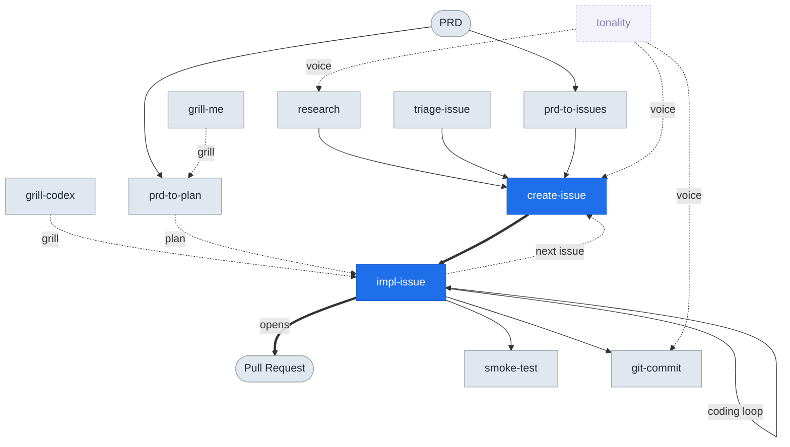

# skills

Craig Trim's Claude Code skills for turning ideas into shipped code.

## How the skills relate

Most work starts as an issue and ends as a pull request. `create-issue` followed by `impl-issue` covers almost every existing issue, and `impl-issue` runs a coding loop until the work is done.

The blue spine is the everyday path. Everything else feeds it: research and triage open issues, PRDs fan out into plans and issues, the grills stress-test a design before code is written, and `tonality` governs every word that reaches a human.

## Skills

### Intake and planning

- **create-issue** — File a GitHub issue in the current repo, auto-detecting the remote and cross-referencing related issues.
- **research** — Research a topic with abundant academic sources, then file the findings as a `research` issue.
- **triage-issue** — Explore the codebase to find a bug's root cause, then file an issue with a TDD-based fix plan.
- **prd-to-issues** — Break a PRD into independently grabbable issues using tracer-bullet vertical slices.
- **prd-to-plan** — Turn a PRD into a multi-phase implementation plan saved as a local Markdown file.

### Implementation

- **impl-issue** — Implement a GitHub issue end to end in an isolated `/tmp` worktree, then open a PR.
- **git-commit** — Atomic commits with conventional prefixes and no attribution footers.
- **smoke-test** — Standards for writing and reviewing smoke tests against a deployed app.

### Stress-testing a design

- **grill-me** — Interview the user relentlessly about a plan, one question per turn, until the design is settled.
- **grill-codex** — The same grill, but the `codex` CLI answers each question instead of the human.

### Cross-cutting

- **tonality** — Enforce Craig's authorial voice in any prose Claude writes or edits.
